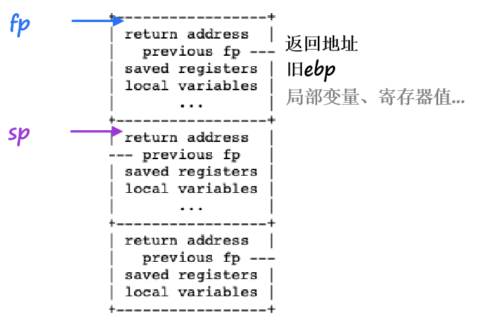

# OS_Lab4_Report

21302010042
侯斌洋

***

## （1）RISC-V assembly  

1. 在main中printf时，a0 存 "%d %d\n" 地址，a1 存 f(8)+1 的值，即12， a2 存 13。
2. 根据 call.asm，main 中应该没有调用 f 和 g ，因为没有跳转到这两个函数的 jalr 指令，应该是在编译时进行了优化直接计算出了 f(8)+1 的值。
3. 0x642，下面为call.asm中的内容：

    ```asm
    //...
    34: 612080e7           jalr 1554(ra) # 642 <printf>
    //...
    0000000000000642 <printf>:
    //...
    ```

4. 0x38，jalr immediate(ra) 跳转到 ra+imm ，然后将 pc+4 赋给 ra。
5. 输出为 HE110 World 。 57616 == 0xe110, 72 6c 64 分别对应 r, l, d。若为大端，则 i 应当设定为 0x726c64, 57616不需要进行改变，因为无论大小端转换过后都应该为0xe110。
6. 应该为寄存器 a2 中原来的值。因为函数需要三个参数，使用 a0, a1, a2，但 a2 并未设置，所以会出现 y 的值不确定的现象。

## （2）Backtrace

1. 运行结果:

    ```shell
    xv6 kernel is booting

    hart 1 starting
    hart 2 starting
    init: starting sh
    $ bttest
    backtrace:
    0x00000000800021d4
    0x00000000800020c6
    0x0000000080001d5c
    $ QEMU: Terminated
    hby@hby-ubuntu:~/Desktop/xv6-labs-2022$ addr2line -e kernel/kernel
    0x00000000800021d4
    /home/hby/Desktop/xv6-labs-2022/kernel/sysproc.c:59
    0x00000000800020c6
    /home/hby/Desktop/xv6-labs-2022/kernel/syscall.c:145
    0x0000000080001d5c
    /home/hby/Desktop/xv6-labs-2022/kernel/trap.c:76
    ^\Quit (core dumped)
    hby@hby-ubuntu:~/Desktop/xv6-labs-2022$ 
    ```

2. 实现：首先根据提示，添加以下代码获取目前执行的函数的 frame pointer  

    ```c
    static inline uint64 r_fp()
    {
        uint64 x;
        asm volatile("mv %0, s0" : "=r" (x) );
        return x;
    }
    ```

    由以下栈帧的结构可知，return address地址为 fp -8（栈地址增长从高到底），上一个函数的起始位置为 fp - 16。  
    
    而且根据提示，要识别当前是否是最后一个栈，可以通过检测 fp 在页表中的位置来实现，由于栈地址增长从高到底，故可用 PGROUNDUP(fp) 来检测，就得到了如下代码：

    ```c
    void backtrace(void){
        uint64 fp = r_fp();
        printf("backtrace:\n");
        
        // stack address increase from high to low
        while(fp != PGROUNDUP(fp)) { 
            // return address
            uint64 ra = *(uint64*)(fp - 8); 
            printf("%p\n", ra);
            
            // previous fp
            fp = *(uint64*)(fp - 16); 
        }
    }
    ```  

3. 运行结果分析：

    观察 bttest，发现其调用了 sleep() ，而在 sys_sleep() 中调用了 backtrace() ，故 backtrace() 会打印在从 sleep 到 sys_sleep 中的所有函数的返回地址，即 trap(), syscall(), sysproc()。由此也可以看出系统调用的过程中会依次调用上面三个函数。

## （3）Alarm

1. alarmtest 运行结果

    ```shell
    xv6 kernel is booting

    hart 1 starting
    hart 2 starting
    init: starting sh
    $ alarmtest
    test0 start
    ...alarm!
    test0 passed
    test1 start
    .alarm!
    alarm!
    alarm!
    alarm!
    alarm!
    .alarm!
    alarm!
    alarm!
    alarm!
    .alarm!
    test1 passed
    test2 start
    ...alarm!
    test2 passed
    test3 start
    test3 passed
    $ 
    ```

2. make grade 运行结果（包含了 usertests 的结果）

    ```shell
    == Test answers-traps.txt == answers-traps.txt: OK 
    == Test backtrace test == 
    $ make qemu-gdb
    backtrace test: OK (3.5s) 
    == Test running alarmtest == 
    $ make qemu-gdb
    (4.1s) 
    == Test   alarmtest: test0 == 
    alarmtest: test0: OK 
    == Test   alarmtest: test1 == 
    alarmtest: test1: OK 
    == Test   alarmtest: test2 == 
    alarmtest: test2: OK 
    == Test   alarmtest: test3 == 
    alarmtest: test3: OK 
    == Test usertests == 
    $ make qemu-gdb
    usertests: OK (132.4s) 
    == Test time == 
    time: OK 
    Score: 95/95
    hby@hby-ubuntu:~/Desktop/xv6-labs-2022$ 
    ```

3. 实现：首先添加 sigalarm(), sigreturn() 系统调用，过程与之前几次lab相同，不再赘述。之后需要在 proc 结构体中添加一些变量为实现 alarm 服务。如下：

    ```c
    int alarm_interval;                 // 每隔多少 ticks 进行alarm    
    uint64 alarm_handler;               // alarm 调用的函数
    int alarm_ticks_passed;             // 目前经过的 ticks  
    struct trapframe *alarm_trapframe;  // 保存之前的 trapframe   
    int handle_now;                     // handler is running!
    ```

    alarm_interval 记录 sigalarm 传入的第一个参数，即每隔多少 ticks 进行一次 alarm，alarm_handler 记录 sigalarm 传入的第二个参数， 即 alarm 时调用的处理函数的地址。alarm_ticks_passed 统计目前经历过的 ticks，每次 alarm 后都重置为 0 。alarm_trapframe 保存调用 alarm_handler 之前的 trapframe 以便于之后进行恢复。handle_now 记录目前是否正在执行 alarm_handler，防止重进 alarm_handler。 
    由于增加了一个 trapframe 结构，故需要改变 proc.c 中的代码使得正确分配和释放该 trapframe，如下：

    ```c
    // allocproc()
    //...
    if((p->alarm_trapframe = (struct trapframe *)kalloc()) == 0){
        freeproc(p);
        release(&p->lock);
        return 0;
    }
    //...
    p->alarm_interval=0;
    p->alarm_handler=0;
    p->alarm_ticks_passed=0;
    ```

    ```c
    // freeproc()
    //...
    if(p->alarm_trapframe)
    kfree((void*)p->alarm_trapframe);
    p->alarm_trapframe = 0;
    ```

    接下来需要实现 sys_sigalarm。如下：

    ```c
    uint64 sys_sigalarm(void){
        // get alarm_interval
        int interval;
        argint(0,&interval);
        if(interval<0){
            return -1;
        }
        
        // get alarm_handler
        uint64 handler;
        argaddr(1,&handler);

        // set values in proc
        struct proc * p;
        p = myproc();
        p->alarm_interval = interval;
        p->alarm_handler = handler;
        p->alarm_ticks_passed = 0;

        return 0;
    }
    ```
    上面的代码为获取参数并设置 proc 中对应的变量，之后要在 trap.c 中实现 alarm 的机制，如下：

    ```c
    if(which_dev == 2){ // timer interrupt.        
        // check if call handler
        if(p->alarm_interval > 0 && ++p->alarm_ticks_passed == p->alarm_interval && !p->handle_now){
            // save trapframe  
            *p->alarm_trapframe = *p->trapframe;

            p->alarm_ticks_passed = 0;
            p->handle_now = 1;
            p->trapframe->epc = p->alarm_handler;
        }
        // give up the CPU if this is a timer interrupt.
        else{
            yield();
        }
    }
    ```
    根据提示，每次进入 trap 且 which_dev == 2 意味着经过了一个 tick。首先对 alarm_interval 是否大于 0 进行检测，因为按照逻辑，alarm_interval 为 0 意味着停止 alarm，故此时应该不会进入 alarm_handler。之后 alarm_ticks_passed 先增 1，然后检测 alarm_ticks_passed 与 alarm_interval 是否相等，若相等则应该进入 alarm_handler，这通过设置 p->trapframe->epc 来实现，主要依据以下 xv6-book中的内容：
    
    和trapframe结构中的内容：

    ```c
    /*  24 */ uint64 epc;           // saved user program counter
    ```

    由以上得出 epc 保存了用户空间的 pc ，故通过设置 pc 为 alarm_handler 的地址就可以跳转到 alarm_handler 函数。由于要保证之后的代码也能正常运行，故在此之前还要保存之前的 trapframe 以便于之后在 sig_return 中恢复。同时还应注意重置 alarm_ticks_passed 为 0，且设置 handle_now为 1 防止 alarm 处理过程中再进入 alarm。于是 if 检测条件中也应增加检测 handle_now 防止重入。
    最后需要实现 sys_sigreturn ，如下：

    ```c
    uint64 sys_sigreturn(void)
    {
        struct proc* p = myproc();

        // reset trapframe
        *p->trapframe = *p->alarm_trapframe;

        p->alarm_ticks_passed = 0;
        p->handle_now=0;

        return p->alarm_trapframe->a0;
    }
    ```
    恢复之前的 trapframe 并重置 alarm_ticks_passed 和 handle_now。由于 sigreturn 为系统调用, 其返回值会被存在 trapframe 的 a0 中，故应返回之前存储的 a0 而不是 0。 

4. 运行结果分析：
    观察alarmtest，test0 测试是否进入过 alarm_handler。test1 测试是否能进行多次 alarm 并进入 alarm_handler，同时返回时是否能恢复之前的状态。test2 测试是否会重进 alarm_handler。test3测试 a0 是否为正确的值，在系统调用返回时会将返回值保存在 a0。根据以上的实现思路，这些测试均可通过。
    usertests 检测是否影响了内核中的其他代码，这里通过make grade 的结果也能看出并没有影响。
