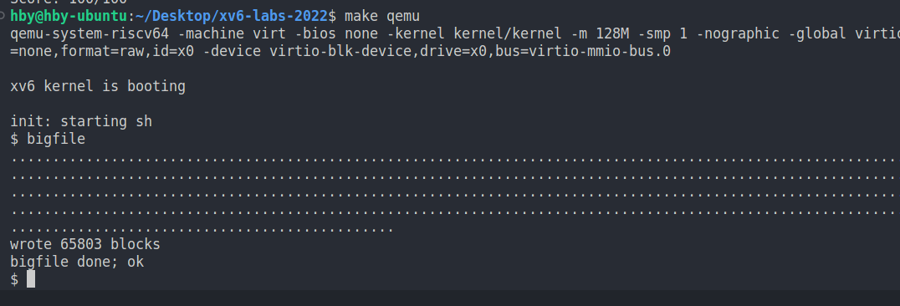
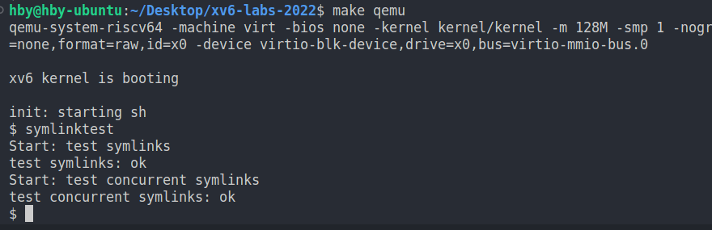
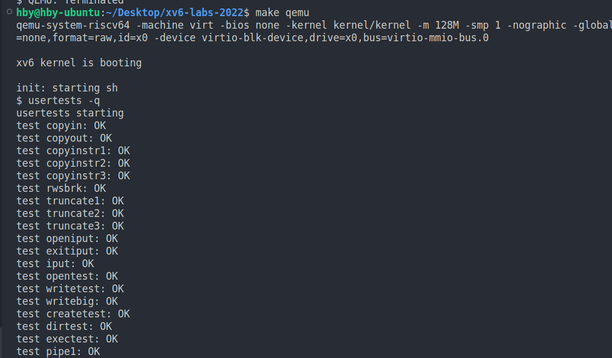
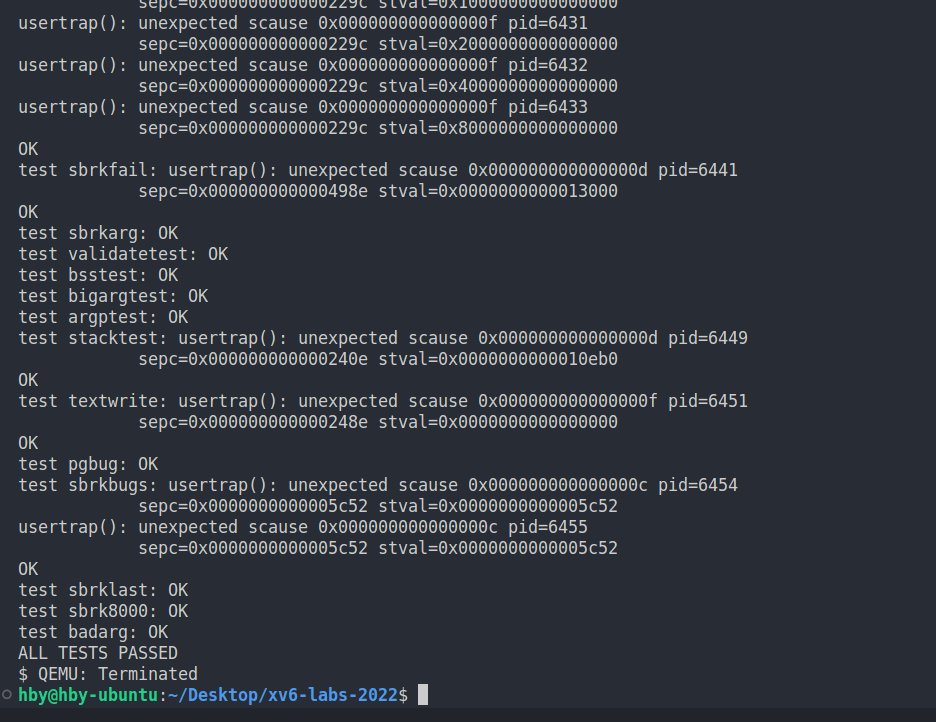
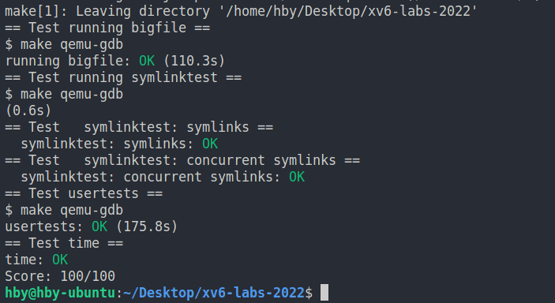
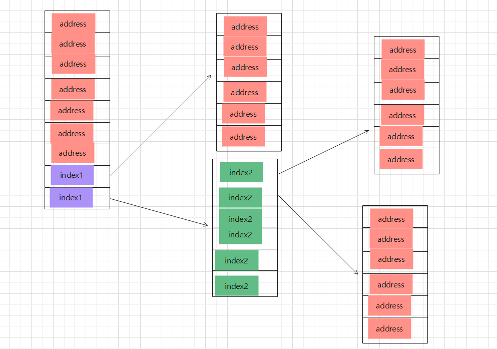
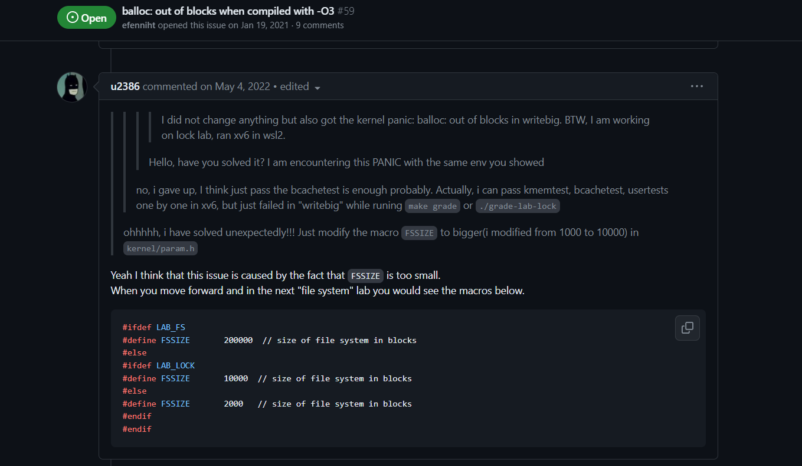

# OS_lab6_report

21302010042
侯斌洋

---

## 运行结果

1. bigfile

   

2. symlinktest

   

3. usertests -q

   

   

4. make grade

   

## Large files (moderate)

#### （1）实验思路

bmap 的作用是将逻辑块映射到物理块，并返回根据逻辑块的位置返回物理块的地址。对于前 11 个直接映射块，直接返回块的地址就行。对于单层非直接块，需要先找到该块，拿到其中的数据，该数据就存储了从 11 到 256+11 的逻辑块地址，然后根据 bn 来找到相应的块地址并返回。对于双层非直接块，需要先找到该块，拿到其中的数据，该数据存储了从 256+11 到 256\*256+256+11 的逻辑块的索引，使用 bn/256 可以获得索引所在位置，使用 bn%256 可以获得块在索引中的偏移。之后拿到索引中的数据，再根据偏移就可以找到块的地址并返回。
itrunc 释放 inode 的块。对于直接映射块，直接释放该块即可。对于单层非直接块，需要先找到该块，拿到其中的数据，然后释放所有该数据中的块，之后再释放该块。对于双层非直接块，需要先找到该块，拿到其中的数据，然后找到数据中的所有块，拿到数据，然后释放所有数据中的块，再释放对应的上层块，等到两层块的数据都释放完了在释放该双层非直接块。

#### （2）实验过程及代码

1. fs.h 中增加双层非直接块的定义并修改其他处的定义以适应该变化

   ```c
   //fs.h
   #define NDIRECT 11
   #define NINDIRECT (BSIZE / sizeof(uint))
   #define NDBINDIR (NINDIRECT * NINDIRECT)
   #define MAXFILE (NDIRECT + NINDIRECT + NDBINDIR)

   //...
   struct dinode {
       //...
       uint addrs[NDIRECT+2];   // Data block addresses
   };
   ```

2. file.h 中也不要忘记修改定义：

   ```c
   //file.h
   struct inode {
       //...
       uint addrs[NDIRECT+2];
   };
   ```

3. fs.c 中按照上面所述的实验思路修改 bmap 和 itrunc 以支持双层非直接块。

   ```c
   // fs.c   bmap()
   static uint
   bmap(struct inode *ip, uint bn)
   {
       uint addr, *a;
       struct buf *bp;

       if(bn < NDIRECT){
           if((addr = ip->addrs[bn]) == 0){
               addr = balloc(ip->dev);
               if(addr == 0)
                   return 0;
               ip->addrs[bn] = addr;
           }
           return addr;
       }
       bn -= NDIRECT;

       if(bn < NINDIRECT){
           // Load indirect block, allocating if necessary.
           if((addr = ip->addrs[NDIRECT]) == 0){
               addr = balloc(ip->dev);
               if(addr == 0)
                   return 0;
               ip->addrs[NDIRECT] = addr;
           }
           bp = bread(ip->dev, addr);
           a = (uint*)bp->data;
           if((addr = a[bn]) == 0){
               addr = balloc(ip->dev);
               if(addr){
                   a[bn] = addr;
                   log_write(bp);
               }
           }
           brelse(bp);
           return addr;
       }
       bn -= NINDIRECT;

       // double indirect block
       if(bn < NDBINDIR){
           // check index1
           if((addr = ip->addrs[NDIRECT+1]) == 0){
               addr = balloc(ip->dev);
               if(addr == 0)
                   return 0;
               ip->addrs[NDIRECT+1] = addr;
           }
           // get index1->data
           bp = bread(ip->dev, addr);
           a = (uint*)bp->data;

           //get index2
           uint index2 = bn/NINDIRECT;
           //get offset
           uint offset = bn%NINDIRECT;

           //check index2
           if((addr = a[index2]) == 0){
               addr = balloc(ip->dev);
               if(addr == 0)
                   return 0;
               a[index2] = addr;
               log_write(bp);
           }
           brelse(bp);
           // get index2->data
           bp = bread(ip->dev, addr);
           a = (uint*)bp->data;

           //check offset
           if((addr = a[offset]) == 0){
               addr = balloc(ip->dev);
               if(addr){
                   a[offset] = addr;
                   log_write(bp);
               }
           }
           brelse(bp);
           return addr;
       }

       panic("bmap: out of range");
   }
   ```

   ```c
   // fs.c   itrunc()
   void
   itrunc(struct inode *ip)
   {
        int i, j, k;
        struct buf *bp,*bp2;
        uint *a,*a2;

        for(i = 0; i < NDIRECT; i++){
            if(ip->addrs[i]){
                bfree(ip->dev, ip->addrs[i]);
                ip->addrs[i] = 0;
            }
        }

        if(ip->addrs[NDIRECT]){
            bp = bread(ip->dev, ip->addrs[NDIRECT]);
            a = (uint*)bp->data;
            for(j = 0; j < NINDIRECT; j++){
                if(a[j])
                    bfree(ip->dev, a[j]);
            }
            brelse(bp);
            bfree(ip->dev, ip->addrs[NDIRECT]);
            ip->addrs[NDIRECT] = 0;
        }

        // double indirect
        if(ip->addrs[NDIRECT+1]){
            // get index1->data
            bp = bread(ip->dev, ip->addrs[NDIRECT]);
            a = (uint*)bp->data;

            for(j = 0; j < NINDIRECT; j++){
                // free index1->data
                if(a[j]){
                    // get index2->data
                    bp2 = bread(ip->dev, a[j]);
                    a2 = (uint*)bp->data;
                    for(k=0; k<NINDIRECT; k++){
                        // free index2->data
                        if(a2[k]){
                            bfree(ip->dev, a2[k]);
                        }
                    }
                    brelse(bp2);
                    bfree(ip->dev, a[j]);
                }
            }
            brelse(bp);
            bfree(ip->dev, ip->addrs[NDIRECT]);
            ip->addrs[NDIRECT] = 0;
        }

        ip->size = 0;
        iupdate(ip);
   }
   ```
   下面这张图应该能很好地解释以上代码：
   
   这样通过修改bmap和itrunc改变了从逻辑块到物理块的映射，从而支持在有限的inode数据中存储更多的块，也就支持了更大的文件大小。

## Symbolic links (moderate)

#### （1）实验思路

此次实验要在xv6中实现符号链接。符号链接是一种新的文件类型，因此首先需要在xv6中添加该文件类型。然后要实现symlink系统调用，symlink的主要思路为path创建一个新的inode，设置文件类型为T_SYMLINK，并在inode中写入target的信息。在sys_open中处理符号链接类型的文件。如果文件为符合链接且打开模式不为 O_NOFOLLOW ，则循环递归直至找到符号链接最终指向的文件。

#### （2）实验过程及代码

1. 添加符号链接文件类型

    ```c
    // stat.h
    #define T_SYMLINK 4   // Symlink
    ```

2. 添加O_NOFOLLOW标志位

    ```c
    // fcntl.h
    #define O_NOFOLLOW   0x1000
    ```

3. 添加symlink系统调用

    ```c
    // user.h
    int symlink(char *target, char *path);
    ```

    ```c
    // usys.pl
    entry("symlink");
    ```

    ```c
    // syscall.h
    #define SYS_symlink  22
    ```

    ```c
    // syscall.c
    extern uint64 sys_symlink(void);

    static uint64 (*syscalls[])(void) = {
        //...
        [SYS_symlink]   sys_symlink,
    }
    ```

4. 接下来实现symlink，首先获取参数，然后为path创建一个新的T_SYMLINK类型的inode并将target写入inode。

    ```c
    // sysfile.c
    uint64
    sys_symlink(void)
    {
        char target[MAXPATH];
        char path[MAXPATH];
        struct inode *ip;

        // get target and path
        memset(target, 0, sizeof(target));
        if(argstr(0, target, MAXPATH) < 0 || argstr(1, path, MAXPATH) < 0){
            return -1;
        }

        // create a new inode with T_SYMLINK
        begin_op();
        if((ip = create(path, T_SYMLINK, 0, 0)) == 0){
            end_op();
            return -1;
        }

        // write target to inode
        if(writei(ip, 0, (uint64)target, 0, MAXPATH) != MAXPATH){
            iunlockput(ip);
            end_op();
            return -1;
        }

        iunlockput(ip);
        end_op();
        return 0;
    }
    ```

5. 最后修改sys_open以处理符号链接类型的文件。如果文件为符合链接且打开模式不为 O_NOFOLLOW ，则循环递归直至找到符号链接最终指向的文件。

    ```c
    // sysfile.c
    uint64
    sys_open(void)
    {
        //...
        if(ip->type == T_DEVICE && (ip->major < 0 || ip->major >= NDEV)){
            iunlockput(ip);
            end_op();
            return -1;
        }
        // handle symlink
        if(ip->type == T_SYMLINK)
        {
            if(!(omode & O_NOFOLLOW))
            {
                int cycle = 0;
                char target[MAXPATH];
                while(ip->type == T_SYMLINK)
                {
                    // 20 cycles max
                    if(cycle == 20)
                    {
                        // fail,not found
                        iunlockput(ip);
                        end_op();
                        return -1;
                    }

                    // find the next target
                    memset(target, 0, sizeof(target));
                    readi(ip, 0, (uint64)target, 0, MAXPATH);
                    iunlockput(ip);

                    // check if target exist
                    if((ip = namei(target)) == 0)
                    {
                        // fail,target not exist
                        end_op();
                        return -1; 
                    }

                    // get lock and go to next loop 
                    ilock(ip);
                    cycle++;
                }
            }
        }

        if((f = filealloc()) == 0 || (fd = fdalloc(f)) < 0){
            if(f)
                fileclose(f);
            iunlockput(ip);
            end_op();
            return -1;
        }
        //...
    }
    ```

## 遇到的问题

usertests writebig 不通过，out of blocks。

在 kernel/param.h 修改 FSSIZE 为原来的 10 倍后，测试通过。

以下为搜寻到的资料。


